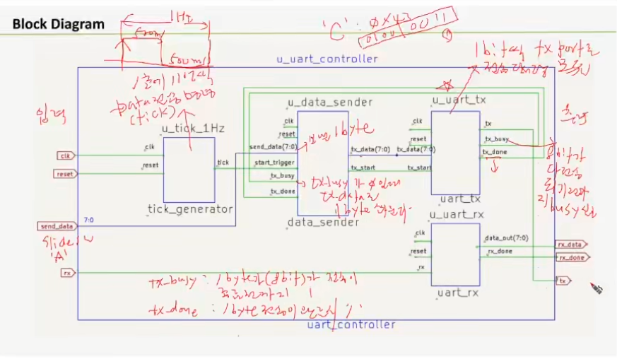
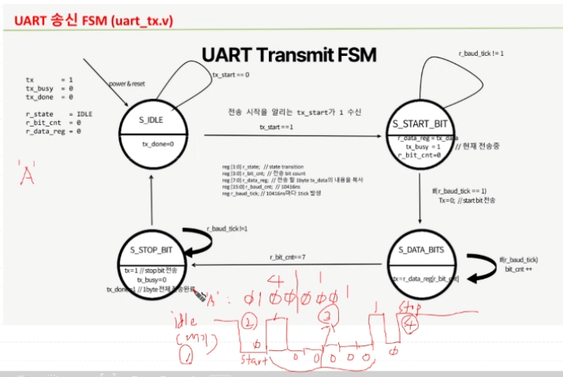

# UART(Universal Asynchronous Receiver Transmitter)

- 클럭 신호를 별도로 사용하지 않음. 
- LSB부터 전송 (1 to 2 : )
- Paritiy Check ( PC to PC)

### 장점
-- MCU / 센서 등 널리쓰임. 
-- 클록 불필요 (비동기)
-- 회로가 간단.

### 단점
-- TCP/IP Ethenet 통신 보단 느림.
-- 송수신 속도 정확히 맞춰야 함. 
-- 1:1 통신만 가능 (다중 노드 통신 어려움)

### 구동 원리
- start bit = 0 , stop bit = 1 fix
- 100MHz -> 9600Hz 로 분주
    -- 100MHz / 9600Hz - 10416.666ns = 10.416us 마다 1bit 보내면 됨.
    -- 100MHz의 1주기 10ns가 1041.6번 반복하면 됨.
    -- 50% Duty Cycle = 10.41666 / 2 = 5.20833us \

- 100MHz -> 115200Hz 로 분주
    -- 100MHz / 115200Hz - 868ns = 10.416us
    -- 100MHz의 1주기 10ns가 868번 반복하면 됨.
    

- baud rate vs bps : 1초당 비트가 변하는 수 vs 1초당 비트가 전송되는 수.

### Block Diagram

- tick_1s : 1초에 한 번씩 데이터 전송.
- tx_busy 가 0 일 때 1bit 씩 전송.
- data는 sw로 임의 입력  ex. 0x30 = sw[7:0] - 0011 0000

- tx_done = 1 : data 8bit 전송이 끝남 → tx_busy = 0
- tx_start를 u_uart_tx로 보내 전송 가능을 알림.
- 외부에서 온 tx_data를 r_reg_data로 저장함.

- data_sender에서 9600/10 = 960자 보낼 수 있음.
